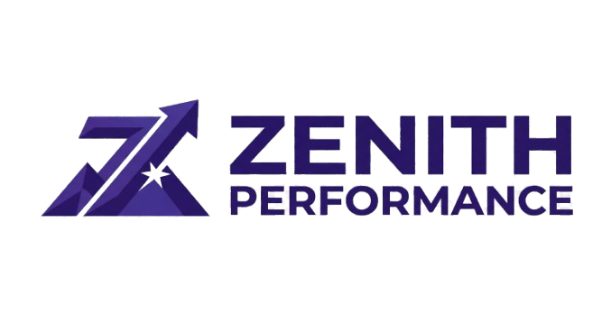

  

<h1 align="center">Zenith Performance Ecommerce</h1>

  Ecommerce desarrollado con Django, orientado a una experiencia de compra moderna, ágil y sólida.

## Descripción

**ZENITH PERFORMANCE** es un ecommerce en evolución constante, desarrollado y mejorado progresivamente desde 2024.  
Este repositorio reúne la base del proyecto, su diseño, funcionalidades y avances, enfocados en ofrecer una experiencia de compra moderna, ágil y sólida, alineada con el crecimiento de la marca, sus objetivos digitales y su visión de futuro.

## Tecnologías utilizadas

- Python
- Django
- HTML
- CSS
- JavaScript
- SQLite3

## Funcionalidades principales

- Catálogo de productos
- Vista de detalle de productos
- Carrito de compras
- Registro e inicio de sesión de usuarios
- Recuperación de contraseña
- Perfil de usuario
- Integración de pagos
- Panel de administración de productos

## Estado del proyecto

Proyecto funcional y en mejora continua, con enfoque en escalabilidad, experiencia de usuario y consolidación de marca digital.

## Autor

Desarrollado por **Miguel Nieto**